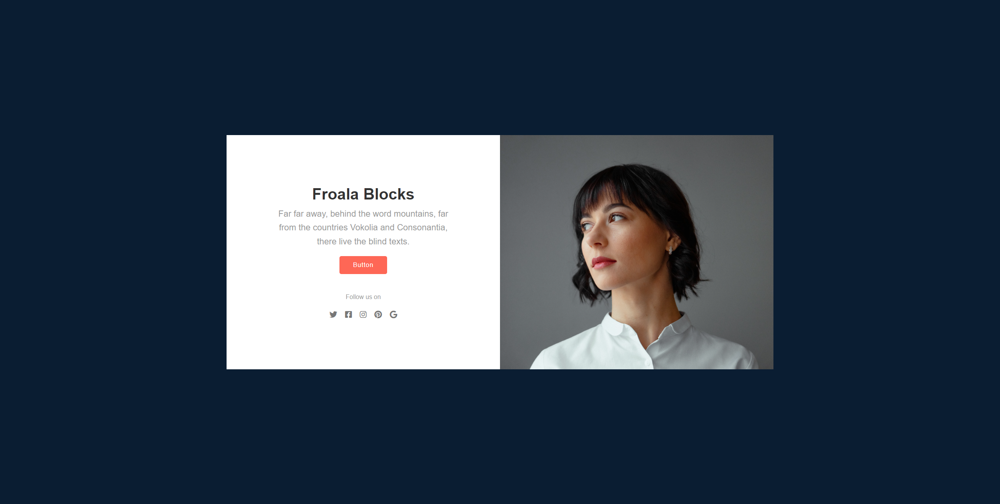
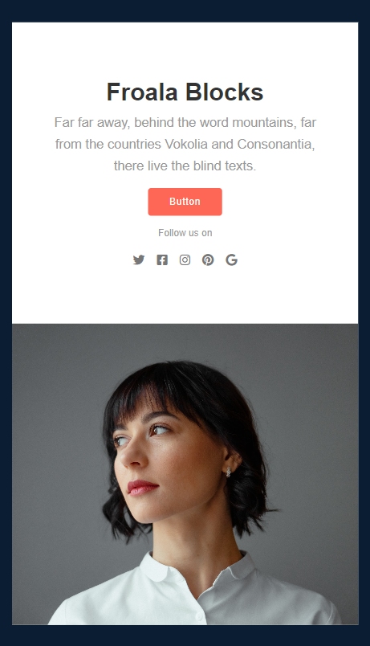

  <h2></h2>
  

    <a href="https://bennatbjoern.github.io/_component-about/">View Demo</a>
    &nbsp;·&nbsp;
    <a href="https://github.com/BennatBjoern/_component-about/issues">Report Bug</a>
    &nbsp;·&nbsp;
    <a href="https://github.com/BennatBjoern/_component-about/issues">Request Feature</a>
  

<!-- Badges -->

  <!-- Status -->
   &nbsp;&nbsp;&nbsp;

 
 

## **Preview**

 

## **Links**

|                |                  |
| :------------- | :--------------- |
| Live Site URL: | [Github Pages](https://bennatbjoern.github.io/_component-about/) |
|                |                  |

 

## **Built With**

 &nbsp; 

 

## **Tools Used**

 &nbsp;  &nbsp;  &nbsp; 

 

## **Acknowledgment**

- Design was provided by [Froala](https://froala.com/)
- Image was provided by [Viktor Bystrov](https://unsplash.com/de/@xokvictor)

 

## **Let's Connect 👋**

  &nbsp;&nbsp;&nbsp;

  &nbsp;&nbsp;&nbsp;

   &nbsp;&nbsp;&nbsp;

  

 
